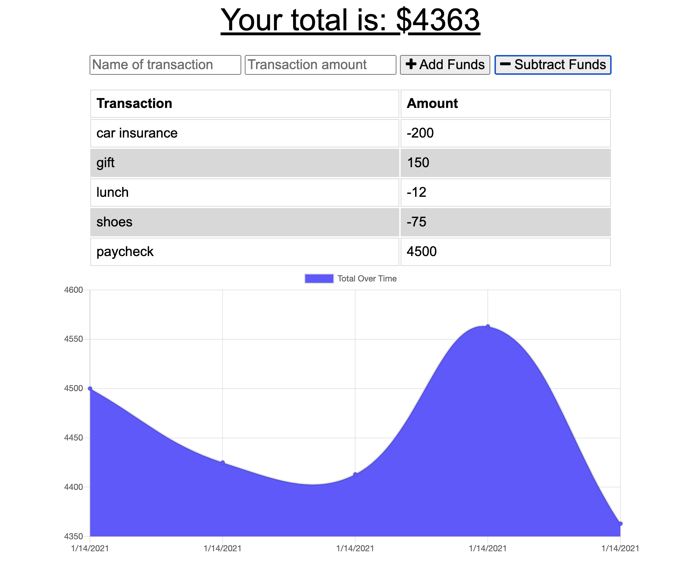
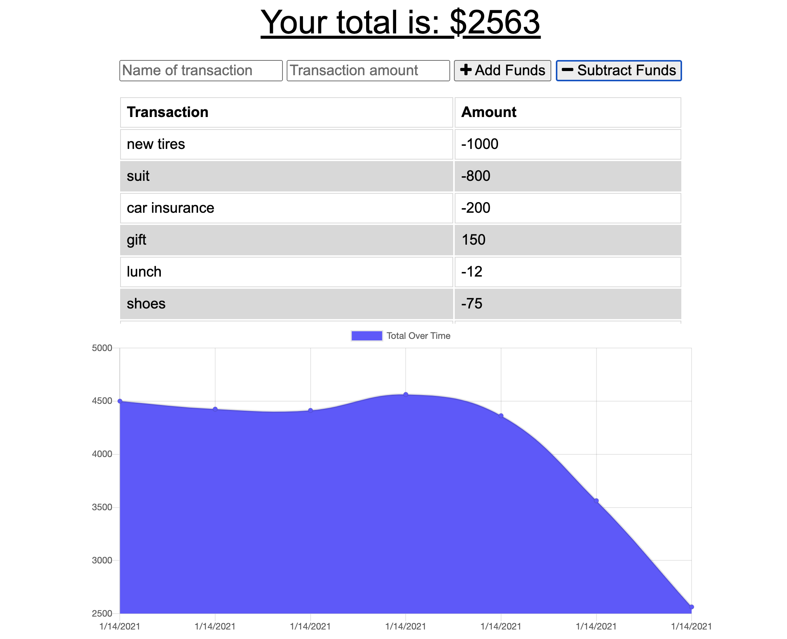

# budget-tracker

## Description

With the help of the budget tracker the user is able to create and track all financial transactions even while offline. This project uses the Mongo database with Mongoose schema and IndexedDB.

## Table of Contents
- [Screenshot](#Screenshot)
- [Technology Concepts](#Technology-Concepts)
- [License](#License)

## Screenshot

## Technology Concepts

* MongoDB
* Mongoose
* Express
* IndexedDB

## License
[MIT](https://choosealicense.com/licenses/mit/#) License